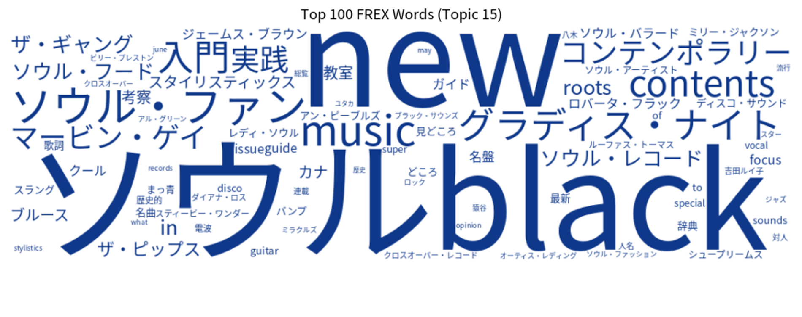
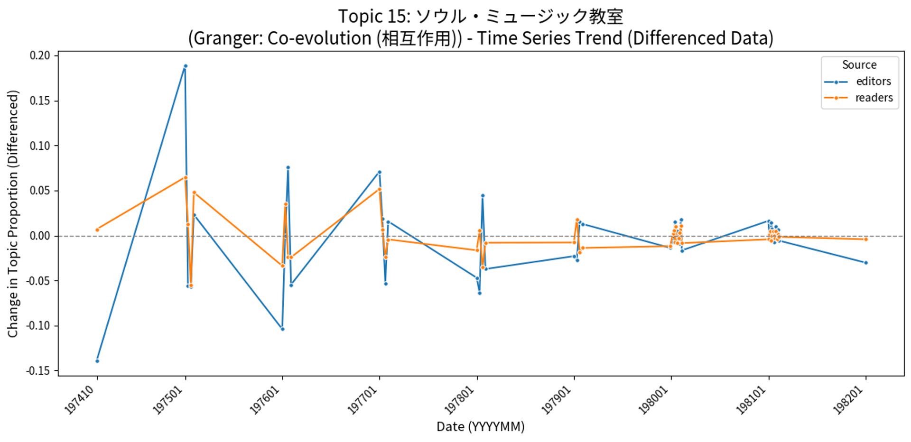
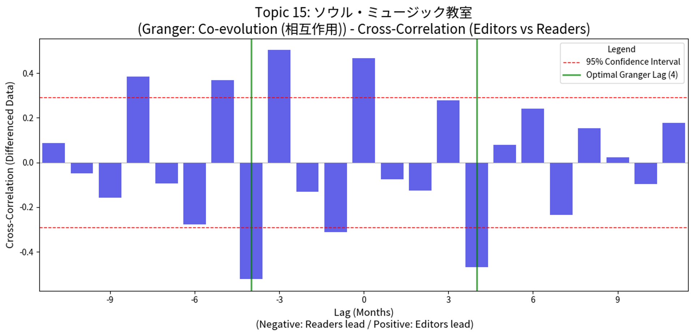
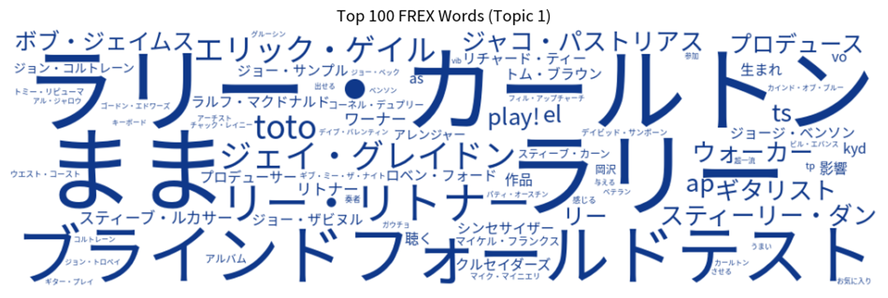
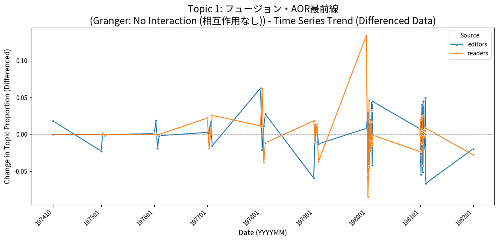
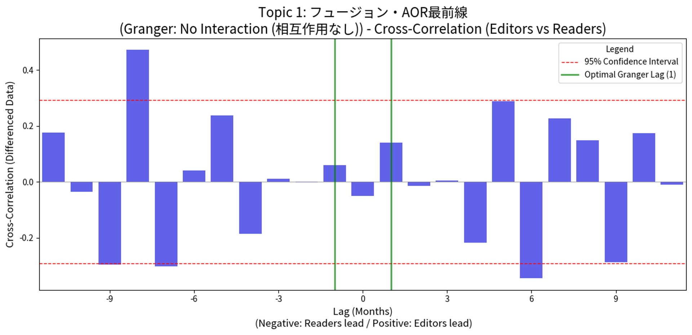

# 補足資料: 分析の詳細と事例検証

**Supplementary Information: Detailed Analysis and Case Studies**

本ドキュメントでは、論文本編で言及しきれなかったモデルの選定根拠、堅牢性、およびトピックの具体的な事例について解説します。

## 1. モデル選定と堅牢性 (Model Selection and Robustness)

本研究では、トピック数 $K$ の決定にあたり、定量的指標（Semantic Coherence, Exclusivity）に加え、人文学的解釈の妥当性を重視しました。
特に $K=20, 23, 25$ の複数のモデルで並行して分析を行い、主要なトピック（読者投稿，新譜紹介等）が安定して抽出されることを確認しています。

## 2. 因果性の解釈について (Interpretation of Causality)

Granger因果性は予測の有用性を示すものであり、直接的な物理的因果を示すものではありません。しかし、本研究では以下の処理を行うことで、擬似相関のリスクを低減しています。

- 階差（Difference）をとることで時系列の非定常性を除去
- VARモデルを用いて最適なラグ（遅れ）を統計的に決定
- CCF（相互相関）のピークと併せて解釈することで、単なる先行だけでなく波形の同期を確認。

(※ データセット `Granger_CCF_Theta_Contents.csv` より抜粋)

## 3. 相互作用類型の詳細事例 (Detailed Case Studies of Interaction Types)

本節では、論文内で紙幅の都合上詳述できなかった共進化型（Co-evolution）および非対話型（No Interaction）の代表的な事例について、トピックの内容（キーワード・代表記事）と時系列統計量の双方から詳細に解説します。各トピックのタイトルや要約は、Gemini 2.5 flashでFREXや代表記事を参照しながら自動的かつ便宜的に付与したものです。

- 元データ期間: 1974/07 - 1982/01 (N=46)
- 差分（階差）データ (N=45) を使用
- 帰無仮説 $H0$: 因果なし

### 3.1. 共進化型 (Co-evolution: E↔R)

**定義:** Granger因果検定において、編集部から読者 ($p < 0.05$)、および読者から編集部 ($p < 0.05$) の双方向の統計的有意性が検出された稀有なケースです。

#### 事例: K=23, Topic 15 「ソウル・ミュージック教室」（ブラックミュージックのジャンル論）

**(Topic: Soul Music Class & Genre Discourse)**

このトピックは、論文本文の訂正箇所において言及すべきであった正当な**共進化型**の事例です。
ここでは、編集部による「ソウル・ミュージックとは何か？」という啓蒙的な連載記事（教室）に対し、読者が熱心な反応や議論（投稿）を返し、それがさらに編集部の企画を深化させるという教育と応答の好循環が観測されます。

* **統計的特徴**:
  * Granger (E→R): p = 0.0005 $p < 0.05$ (有意)
  * Granger (R→E): p = 0.0001 $p < 0.05$ (有意)
  * Interaction: 編集部と読者が互いに影響を及ぼし合っている。
  * FREX: ソウル, new, black, ソウル・ファン, music, グラディス・ナイト, 入門, contents
* **Topic Summary by Gemini 2.5 flash**: 1970-80年代初頭の音楽雑誌における、ソウル/ブラックミュージックの入門、名曲・名盤ガイド、歴史的考察が議論の中心。編集部が情報を提供し、読者が「ソウル・ベストを選ぶ」等能動的に反応、その反応を編集部が記事化する双方向の活発な相互作用が見られた。
* **代表的記事（Representative Articles）:**
  （※ データセット `Granger_CCF_Theta_Contents.csv` より、K=23, T=15 の上位記事を抜粋）

| Rank | Theta (比率) | 掲載年月 | 記事抜粋（見出し・文脈）                                               |
| :--: | :----------: | :------: | :--------------------------------------------------------------------- |
|  1  |    0.939    | 1975/07 | レディ・ソウル入門実践教室山口弘滋 - 美人のレディ・ソウルが楽しみた... |
|  2  |    0.920    | 1975/01 | GUIDE to SOUL & IT'S RECORDS ソウル入門実...                           |
|  3  |    0.905    | 1975/04 | HOW TO PLAY THE GUITAR:山内博春 — 134 志...                           |

###### 図1 K=23, T=15のFREX Top 100を使ったワードクラウド。

###### 図2 K=23, T=15のGranger因果検定結果。グラフは各年のトピック占有率（差分増加量）を表現する。

Digital側著者の意見：Granger因果検定で示されているのは1977年1月号あたりでグラフパターンに違いがある。この号あたりより前は本トピックの話題量がまちまちで不安定であった。後になると、定番化したのか一定量を保っている。

###### 図3 K=23, T=15のCCF（交差相関分析）。X軸（ラグ、時間的なずれ）の0を起点として左側が読者先行側、右側が編集者先行側のトピック差分増加量を示す。Y軸の値で有意とみなすのは赤い点線を超えたグラフ。

Digital側著者の意見：例えばLag 0では読者／編集者同時に本トピックの話題を共有している。これは同時的な外部要因（ミュージシャン来日や景気上昇、電子楽器・コンポ・カセットデッキ需要増など）が起きたためである可能性がある。Lag -8, -5, -3では、読者が編集者よりも8, 5, 3ヶ月前に本トピックの話題を多く出している。しかし、Lag -4, -1で読者側, +4で編集側にそれぞれ負の相関が表れている。負の相関は話題の抑制・鎮静化を表す。すなわち、互いに4ヶ月遅れで本トピックを抑制あるいは話題の量を調節しあっていることが考えられる。ただ、データの取り方にも左右されている可能性があるので、この点は本研究の今後の課題である。

Digital側著者の意見：Granger検定とCCFを合わせると、1977年1月あたりより前の時期に、雑誌の企画決定に本トピックは比較的強い影響力を持っていたと考えられる。そして、これ以降は盛り上げすぎないよう、あるいは盛り下げすぎないよう、読者と編集者側で結果的にバランスよく続いた定番の話題の可能性がある。これらの結果は、雑誌が創刊時の実験的な段階を終え、読者と編集部の暗黙の了解に基づく安定的なコミュニティへと成熟していった歴史的な過程を、定量的に示唆するものである。

#### （参考）CCFグラフの解説

| ラグ (Lag)     | 相関 (Y軸)     | 棒の色（濃い青） | 意味・解釈の試み                                                                                                                                                                                                                                                                         |
| -------------- | -------------- | ---------------- | :--------------------------------------------------------------------------------------------------------------------------------------------------------------------------------------------------------------------------------------------------------------------------------------- |
| Lag -8, -5, -3 | 正（高い）     | 赤点線より上     | 読者リードによる増幅。読者の熱量（投稿）が高まってから3, 5, 8ヶ月後に、編集部もそのトピックへの言及を増やす（同調する）動き。これはボトムアップ的な影響の一側面。                                                                                                                        |
| Lag 0          | 正（やや高い） | 赤点線より上     | 同時相関 。同じ月に編集部と読者が共にこのトピック（ソウル・ミュージックのジャンル論）を語り合っている状態。中核的な話題において相互に影響を与え合っている（共進化） 。                                                                                                                   |
| Lag -4, +4     | 負（低い）     | 赤点線より下     | (+4) 編集部リードによる抑制 。編集部が4ヶ月先行して記事を出した後に、読者の言説が減る（反動で沈静化する）動き 。編集部が情報を提供したことで、読者の議論が一時的に「満たされた」と解釈できる。 (-4) 読者リードによる抑制。読者が4ヶ月先行して記事を出した後に、編集者の言説が減る。 |

### 3.2. 非対話型 (No Interaction)

**定義:** Granger因果検定において、双方向ともに有意な先行関係が検出されなかった ($p > 0.05$) ケースです。
しかし、これは「無関係」であることを必ずしも意味しません。Granger検定のラグ（数ヶ月）の範囲内では因果関係が捕捉できなかったものの、長期的には相関しているケースなどが含まれます。

#### 事例: K=23, Topic 1 「フュージョン・AOR 最前線」

**(Topic: Fusion & AOR Frontline)**

このトピックは、Granger検定上は非対話型に分類されます。しかし、CCF（相互相関）分析を見ると興味深い挙動を示しており、統計的な因果性は弱いが、トレンドとしては強く同期している（あるいはラグが複雑である）典型例と言えます。

* **統計的特徴:**
  * Granger (E→R/R→E): $p > 0.05$ (非有意)
  * CCF Analysis: Lag -8 (読者が先行) の時点で強い正の相関が観測されている。
  * **解釈:** 短期的な「問いかけと応答」のサイクルではなく、読者の長期的な嗜好の変化に、編集部が緩やかに追随した（あるいはその逆）可能性があります。
* **代表的記事（Representative Articles）:**
  （※ データセット `Granger_CCF_Theta_Contents.csv` より、K=23, T=1 の上位記事を抜粋）

| Rank | Theta (比率) | 掲載年月 | 記事抜粋（見出し・文脈）                                                 |
| :--: | :----------: | :------: | :----------------------------------------------------------------------- |
|  1  |    0.977    | 1980/08 | 野口五郎のクロスオーバーアンテナ ●腹7分目の心地よいサウンド ---...      |
|  2  |    0.976    | 1980/03 | 野口五郎のクロスオーバー・アンテナ ▲本誌のレキュラー筆者になった五郎... |
|  3  |    0.963    | 1981/01 | 野口五郎のクロスオーバーアンテナ ●この1年いろんなサウンドに熱中した...  |

###### 図4 K=23, T=1のFREX Top 100を使ったワードクラウド。「まま」の意味は、感じる「まま」と同じ意味。

Digital側著者の意見：野口五郎氏の名前はこのトピックの話題にどれだけ関与している代表文書なのかを示すThetaに出てくるが、FREXなどの指標キーワードには一切出てこない。当時、歌謡界のスターだった野口氏は、本誌において自分のコーナーを持つようになり、演奏技術論・評論的側面の強い内容を執筆していた。このコーナーを通じて野口氏は洋楽志向のマニアックなトピックを読者に届けるという**橋渡し役**を担っていたと考える。

###### 図5 K=23, T=1のGranger因果検定結果。グラフは各年のトピック占有率（差分増加量）を表現する。

Digital側著者の意見：図2と図5のY軸を見比べるとこちらの方が目盛りが1/4である。よって、グラフとしては1979-1980年にある大きな増加はそこまで大きな特徴とはいえない。このことから、本トピックは、マニア向け安定的な記事であろうことを示唆している。

###### 図6 図3 K=23, T=1のCCF（交差相関分析）。X軸（ラグ、時間的なずれ）の0を起点として左側が読者先行側、右側が編集者先行側のトピック差分増加量を示す。Y軸の値で有意とみなすのは赤い点線を超えたグラフ。

Digital側著者の意見：CCFのグラフではLag -8の時に強めの正の相関を示しており、Lag -7および+6の時に負の相関を示した。

#### （参考）CCFグラフの解説

| ラグ (Lag) | 相関 (Y軸)    | 意味・解釈の試み                                                                                                                                                                                                                                     |
| ---------- | ------------- | :--------------------------------------------------------------------------------------------------------------------------------------------------------------------------------------------------------------------------------------------------- |
| Lag -9     | 負（-約0.29） | 読者リードによる早期の反動（抑制の兆候）。読者が9ヶ月先行して熱意を示し始めると、編集部はすぐに追随せず、むしろ言説の量を一時的に抑制する（相殺する）傾向が見られる。                                                                                |
| Lag -8     | 強い正        | 読者リードによる増幅（長期計画）。読者が8ヶ月先行して熱意を示すと、編集部はそれを長期的・構造的な企画（例：連載）として受け入れ、言説を増幅させる。これは、フュージョン・AORという定番ジャンルに対する構造的な共振を示唆。                           |
| Lag -7     | 負            | 読者リードによる迅速な排除（抑制の反転）。Lag -8の増幅効果が発動する直前の、わずか1ヶ月のタイミングのズレが、増幅を抑制に反転させています。編集部の計画サイクルに合わないニーズは不採用となる可能性を示唆。                                          |
| Lag  +6   | 負            | 編集部リードによる長期的抑制。編集部が6ヶ月先行して情報提供や専門的な記事（ブラインド・フォールド・テストなど）を出した後、読者の言説が強く抑制される。この長いラグ（6ヶ月）は、編集部の情報が読者に深い満足を与え、議論の余地を減らしたことを示唆。 |
